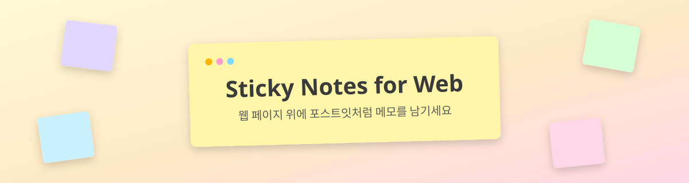
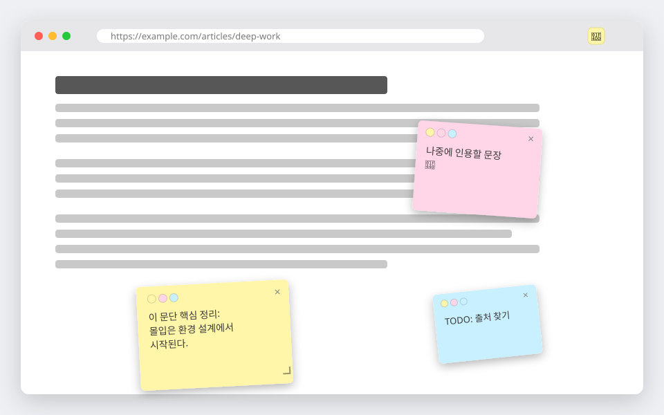
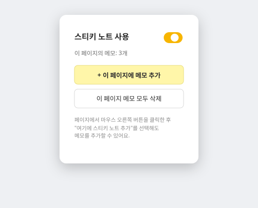

<p align="center">
  
</p>

<p align="center">
  웹 서핑 중 페이지 위에 포스트잇처럼 메모를 붙이고, 다시 방문해도 그대로 남아있는 크롬 익스텐션
</p>

<p align="center">
  
  
  
  <a href="LICENSE"></a>
</p>

---

## ✨ 주요 기능

| | |
|---|---|
| 📌 **페이지에 고정** | 메모는 URL(해시 제외) 기준으로 저장되어, 같은 페이지로 돌아오면 자동으로 다시 나타납니다 |
| ✋ **자유로운 편집** | 드래그로 위치 이동, 모서리로 크기 조절, 클릭 한 번으로 텍스트 편집 |
| 🎨 **5가지 색상** | 헤더의 색상 점을 눌러 노트별로 색을 바꿀 수 있어요 |
| 🖱️ **우클릭으로 빠르게 추가** | 페이지 아무 곳이나 우클릭 → "여기에 메모 추가" |
| 🔌 **켜고 끄기** | 툴바 팝업의 토글 하나로 모든 탭의 메모를 즉시 표시/숨김 |
| 🧭 **SPA 대응** | 유튜브·깃허브처럼 새로고침 없이 URL이 바뀌는 사이트에서도 페이지별로 메모가 따라옵니다 |
| 🛡️ **스타일 격리** | 노트는 Shadow DOM 안에서 렌더링되어 사이트 CSS의 영향을 받지 않아요 |
| 🌐 **다국어** | 한국어 · 영어 (`_locales/`) |
| 💾 **로컬 저장** | `chrome.storage.local`에만 저장되며, 외부 서버로 전송되지 않아요 |

## 🖼️ 미리보기

<p align="center">
  
  <br/>
  <sub>페이지 위에 자유롭게 배치된 메모</sub>
</p>

<p align="center">
  
  <br/>
  <sub>툴바 팝업: 켜기/끄기, 메모 추가·전체 삭제</sub>
</p>

## 🚀 설치 방법 (개발자 모드)

1. 크롬 주소창에 `chrome://extensions` 입력 후 이동
2. 우측 상단 **개발자 모드** 켜기
3. **압축해제된 확장 프로그램을 로드합니다** 클릭
4. 이 저장소 폴더 선택

Chrome 102 이상이 필요합니다.

## 📖 사용 방법

- **메모 추가**: 툴바 아이콘 클릭 → `+ 이 페이지에 메모 추가`, 또는 페이지 우클릭 → `여기에 메모 추가`
- **이동**: 노트 상단 헤더를 드래그 (마우스 · 터치 · 펜 모두 지원)
- **크기 조절**: 노트 우측 하단 모서리를 드래그
- **색상 변경**: 헤더의 색상 점 클릭
- **삭제**: 헤더 우측 `×` 클릭, 또는 팝업의 `이 페이지 메모 모두 삭제`
- **전체 켜기/끄기**: 팝업 상단 토글 스위치

## 🔐 권한

| 권한 | 용도 |
|---|---|
| `storage` | 메모와 켜기/끄기 상태를 로컬에 저장 |
| `contextMenus` | 우클릭 메뉴 항목 추가 |

`host_permissions`, `activeTab`, `tabs` 권한은 사용하지 않습니다. 페이지 접근은 `content_scripts`의 `matches`만으로 이루어지고, 팝업은 탭 URL을 읽는 대신 컨텐트 스크립트의 응답 여부로 사용 가능 상태를 판단합니다.

## 🗂️ 프로젝트 구조

```
pagepin/
├── manifest.json         # Manifest V3 설정
├── stn-core.js           # 순수 로직 (페이지 키·정규화·검증·클램프) — 테스트 대상
├── styles.js             # Shadow DOM 안에 주입되는 노트 스타일
├── content.js            # 노트 렌더링 · 드래그 · 리사이즈 · 저장 · SPA 추적
├── background.js         # 우클릭 메뉴, 기본 설정 초기화
├── popup.html/js/css     # 툴바 팝업 UI
├── _locales/{en,ko}/     # 번역 메시지
├── test/                 # node:test 단위 테스트 (의존성 없음)
├── icons/                # 확장 프로그램 아이콘
└── assets/               # README용 이미지
```

## 💾 데이터 저장 구조

페이지마다 **독립된 저장소 키**를 사용합니다. 한 탭의 저장이 다른 탭의 메모를 덮어쓰는 일이 구조적으로 발생하지 않습니다.

```jsonc
// chrome.storage.local
{
  "enabled": true,
  "n:https://example.com/path": [
    { "id": "n123", "text": "메모 내용", "x": 120, "y": 340, "w": 220, "h": 160, "color": "#fff6a9", "z": 1 }
  ],
  "n:https://example.com/other?q=1": [ /* ... */ ]
}
```

- 페이지 키는 `origin + pathname + search`로 만들어지며, 해시(`#...`)는 포함되지 않습니다.
- `z`는 노트 개수 범위(`1..n`) 안에서 저장·정규화됩니다.

## 🧪 개발

빌드 도구도, 의존성도 없습니다. Node 18 이상만 있으면 됩니다.

```bash
node --test        # 단위 테스트 (stn-core + manifest/i18n 정합성)
npm test           # 위와 동일
npm run check      # 모든 스크립트 문법 검사
```

`stn-core.js`에는 DOM과 `chrome.*`에 의존하지 않는 순수 로직만 들어 있어 그대로 Node에서 테스트됩니다. 컨텐트 스크립트는 이 모듈을 `content_scripts`로 불러 씁니다. GitHub Actions(`.github/workflows/ci.yml`)에서 문법 검사 · JSON 검증 · 테스트가 실행됩니다.

## 📄 License

[MIT](LICENSE)

---

<p align="center"><sub>Made for personal note-taking while browsing. 🗒️</sub></p>
